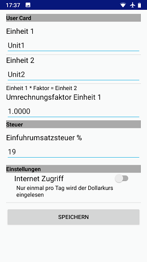

# US Travel Converter

The most common US units are transformed to SI units and some less common like gas price from $/gal to €/l. If you want to buy some gifts, you can calculate the EU import charges on second page.

If you need to convert a special unit, you can define your own.
Hint: Try to touch the unit to change it.

  

  

### Prerequisites

min Android API 15

## Built With

* Android Studio 

## License

This project is licensed under the GPL 3.0 License - see the file for details

## Aknowledgements

Many thanks to the photographers from [unsplash.com](https://www.unsplash.com) and [pixabay.com](https://www.pixabay.com): 
Vitaly, Evan Dennis, Jeff Cooper, Jeff Sheldon, Jon Flobrant, Philip Swinburn, Jonathan Petersson,
Patrick Tomasso, Yaoqi Lai, Bhavyesh Acharya, Maria Molinero

