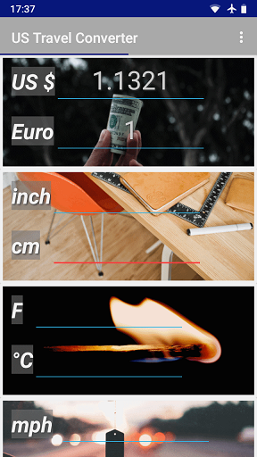

# US Travel Converter

The most common US units are transformed to IS units. If you want to buy some gifts, you can calculate the EU import charges on second page.

If you need to convert a special unit, you can define your own.
Hint: Try to touch the unit to change it.

  


  


### Prerequisites

min Android API 15


### Installing

Install [apk](https://github.com/Omikronpercy/USTravelConverter2/releases) file.


```
USTravelConverter.apk
```


## Built With

* Android Studio 


## License

This project is licensed under the GPL 3.0 License - see the file for details

## Aknowledgements

Many thanks to the photographers from [unsplash.com](https://www.unsplash.com) and [pixabay.com](https://www.pixabay.com): 
Vitaly, Evan Dennis, Jeff Cooper, Jeff Sheldon, Jon Flobrant, Philip Swinburn, Jonathan Petersson,
Patrick Tomasso, Yaoqi Lai, Bhavyesh Acharya, Maria Molinero

